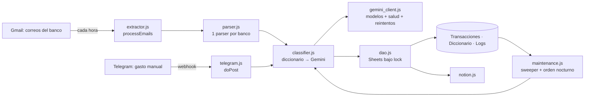

# Asistente Bancario

Ingesta automática de gastos desde correos de bancos chilenos (BCI, Tenpo, MACH, Banco de Chile) y
desde un bot de Telegram hacia Google Sheets y, opcionalmente, Notion. Un diccionario local y Gemini
categorizan cada transacción. Corre íntegramente en Google Apps Script (runtime V8).

> Licencia: uso personal y no comercial, sin modificación. Ver `src/LICENSE.js`.

## Cómo funciona



1. **Extracción** (`processEmails`, trigger horario): busca correos bancarios no etiquetados, los
   parsea, clasifica y guarda. Solo **después de guardar** etiqueta el hilo como procesado.
2. **Clasificación**: primero el Diccionario (sin gastar cuota); solo los comercios desconocidos van a
   Gemini, en lotes, con salida estructurada. Si la IA falla, la transacción se guarda como
   `Por Clasificar Automáticamente` y se **reintenta sola** (fin de cada corrida y cada noche).
3. **Mantenimiento** (`cleanAndSortData`, 2 AM): reclasifica pendientes y ordena la hoja para Looker Studio.
4. **Telegram**: registrar gastos (`15000 Panadería`), borrar (`/borrar ID1 ID2`) y recibir alertas.
   Solo responde al chat autorizado (`TELEGRAM_CHAT_ID`).

## Estructura

```
src/            ← lo único que se despliega a Apps Script (clasp rootDir)
tests/          ← pruebas en Node (harness que simula los servicios de Google)
docs/           ← AUDITORIA.md (hallazgos) · ROADMAP.md (oportunidades)
scripts/        ← verificación de sintaxis e informe de defectos conocidos
```

Todos los archivos de `src/` comparten un único namespace global (así funciona Apps Script): nunca se
declara el mismo nombre en dos archivos (lo verifica una prueba) y ningún código de nivel superior
depende de otro archivo, de modo que el orden de carga no importa.

## Desarrollo

Requiere Node ≥ 22.

```bash
npm install
npm run check      # sintaxis + Prettier + ESLint + tsc (checkJs, strict) + pruebas
npm test           # solo las pruebas
npm run test:coverage
node scripts/todo-report.js   # defectos conocidos que aún fallan (pruebas `todo`)
```

Las pruebas cargan `src/` en un contexto `vm` como lo haría Apps Script y simulan Sheets, Gmail,
UrlFetch, Cache, Lock, Gemini, Telegram y Notion (incluidos los errores reales del incidente de
septiembre de 2026). No se necesita cuenta de Google para ejecutarlas.

## Despliegue con clasp

Primera vez:

1. `npx clasp login` (abre el navegador) y habilita la **Apps Script API** en
   <https://script.google.com/home/usersettings>.
2. Copia `.clasp.json.example` a `.clasp.json` y completa `scriptId` (Apps Script → Configuración del proyecto).
3. **Antes de subir nada**, respalda lo que hay en Google: `npx clasp pull` en una carpeta aparte y
   crea una versión (`npx clasp version "pre-auditoria"`). Así puedes volver atrás.

Cada despliegue:

```bash
npm run check
npx clasp push                 # sube src/ (reemplaza el proyecto remoto)
npx clasp version "descripción"
npx clasp deployments          # busca el ID de la Web App vigente
npx clasp deploy -i <deploymentId> -d "descripción"   # MISMO ID: la URL del webhook no cambia
```

> **No crees un despliegue nuevo** de la Web App: cambiaría la URL y el webhook de Telegram dejaría de
> llegar. Las Script Properties, los triggers y los datos no cambian con `clasp push`.

**Rollback**: `npx clasp deploy -i <deploymentId>` con la versión anterior
(`--versionNumber N`), o `git checkout` del commit anterior + `clasp push`.

## Configuración (propiedades del script)

Se editan desde el menú **🤖 Asistente bancario → Configurar Credenciales** o con `setEnv(clave, valor)`.

| Propiedad                                                           | Uso                                                                                      |
| ------------------------------------------------------------------- | ---------------------------------------------------------------------------------------- |
| `GEMINI_API_KEY`                                                    | Llave de la API de Gemini                                                                |
| `GEMINI_ANALYZE_TRANSFERS`                                          | `true`/`false`: permite enviar a Gemini el comentario de las transferencias (privacidad) |
| `GEMINI_ALLOW_PRO`                                                  | `true` para permitir modelos Pro como último recurso (no hay cuota gratuita)             |
| `GEMINI_MODELS`                                                     | Lista CSV de respaldo si `ListModels` no responde                                        |
| `TELEGRAM_BOT_TOKEN` · `TELEGRAM_CHAT_ID` · `TELEGRAM_SECRET_TOKEN` | Bot, chat autorizado y secreto del webhook                                               |
| `WEB_APP_URL`                                                       | URL de la Web App desplegada                                                             |
| `NOTION_API_TOKEN` · `NOTION_DATABASE_ID` · `NOTION_ENABLED`        | Integración con Notion                                                                   |
| `INITIAL_BACKFILL_COMPLETED`                                        | `false` = ventana de 365 días; `true` = 5 días                                           |

## Si algo falla (runbook)

- **Transacciones en «Por Clasificar Automáticamente»**: no hace falta hacer nada; se reintentan solas.
  Para forzarlo: menú **🔄 Re-procesar huérfanos** (ignora los enfriamientos de modelos).
- **Alerta «Gemini API no disponible»**: el detalle trae el motivo por modelo (`503`, `429 quota_zero`,
  `404`…). `quota_zero` en modelos Pro es normal en el tier gratuito. Si es `auth`, revisa la API key.
- **Correo no interpretado**: quedó con la etiqueta `SaaS_Finanzas/Error_Parseo`; el banco cambió el
  formato. Para reprocesarlo después de ajustar el parser, quítale la etiqueta `SaaS_Finanzas/Procesado`.
- **Comprobar todo**: menú **🩺 Diagnóstico del sistema** (propiedades, hojas, triggers, cascada de
  modelos, llamada real a Gemini y reentrancia del lock). No muestra credenciales.

## Documentación

- `docs/AUDITORIA.md`: hallazgos, causas del incidente de Gemini y estado de cada corrección.
- `docs/ROADMAP.md`: mejoras y funcionalidades nuevas priorizadas.
